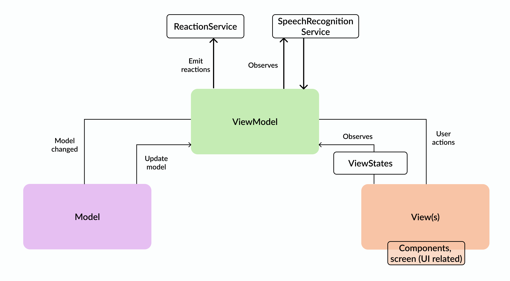

# Words Scape Game - Documentation

This is the repository for “Words Scape Game”, a project to study the JetpackCompose.

- The game challenges players to capture words moving horizontally across multiple lanes at varying speeds, either by tapping them or speaking them aloud using ASR. 
- Words that escape are vocalized by the system's TTS engine. 
- The app ensures smooth animations for fluid performance and includes a reset feature to restart the game. 
- There's also a score count for caught and lost words.

## Design

Design

Design is always my first step when starting a new project. I begin by researching similar apps on the Play Store or App Store and exploring platforms like Dribbble for inspiration. For this app, I discovered a game (shown in the image above) that served as the foundation for my design approach.

## Architecture

After completing the design, I carefully considered the best architecture to meet the app's requirements. Given its nature as a game with numerous states, animations, and custom views, I chose to use Jetpack Compose combined with MVVM.

High-level architecture

### Libraries

As this app doesn’t have to connect to any API, don't have any images and only rely in custom views and animations, most of the libraries I used were native.

**External Libraries**

- **Hilt:** for dependency injection, it reduces boilerplate and makes it easy to manage and inject dependencies. And also makes it easier for testing, allowing mock dependencies to be injected during tests.
- **Mockito:** for helping to create mock objects when writing and performing tests.

**Native Libraries**

- Jetpack Compose
- SoundPool (for playing the effects when the user “catches” a word)
- TextToSpeech (for TTS)
- SpeechRecognition (for ASR)

## Project Structure

The project is structure like the following:

- **Core:** contains fundamental classes and utilities used across different layers
- **Domain:** encapsulates the business logic and rules
- **Presentation:** contains everything related to the UI

# Improvements #TODO

The native SpeechRecognizer for Android does not process the audio on real-time, so every time we say something, even if we decrease the silence time, the Recognizer takes some time to return to us, what creates a not so good experience for the user. I believe that using a ML model for speech-to-text would be better, where we can listen directly with Android's native AudioRecord library, get the audio as bytes (buffer) and process with the ML model.

Another improvement would be to calibrate the user's voice and apply Speech Separation, and isolates each voice signal.
