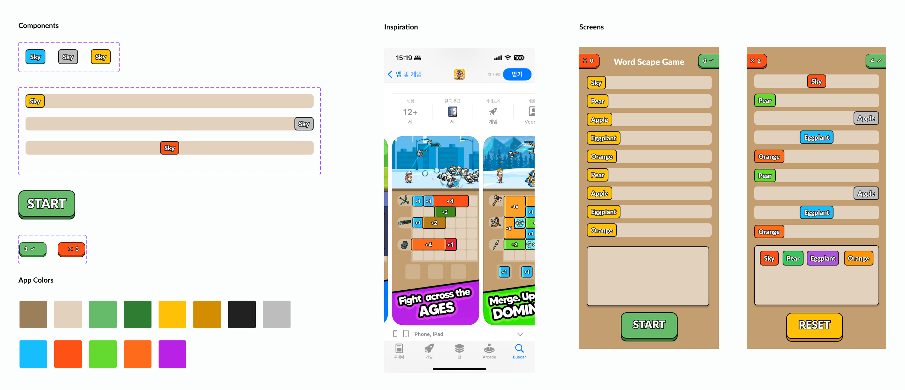

# Words Scape Game - Documentation

This is the repository for the coding test “Words Scape Game”,  I believe that all the requested requirements were fulfilled in this game.

## Design

Design

Every time I start a project the first step to get into is the Design. I start looking for similar apps on Play Store or App Store, and I also check the Dribbble website. For this app in particular, I found a game (as shown in the picture above) that I could base my design on. 

## Architecture

After finishing the design I also spend some time thinking about what would be the best choices in terms of architecture. 

As this app is a game and has a lot of states, animations, and custom views to consider, I decided to use Jetpack Compose with MVVM. 

High-level architecture

### Jetpack Compose

Although I’m used to creating layouts with XML, as this app needed a lot of view customization with animation dependance, Jetpack Compose was my choice, because:

- it's designed to react to state changes automatically
- has a rich set of APIs for creating animations
- allows us to build UI components as simple, reusable, and composable functions

### MVVM (Model-View-ViewModel)

I chose MVVM because it's broadly used and stablished for Android app development, and separates the user interface (View) from the business logic (Model) using the ViewModel as an intermediary, and because of that it's easier to escalate, maintain and test.

### Libraries

As this app doesn’t have to connect to any API, don't have any images and only rely in custom views and animations, most of the libraries I used were native

**External Libraries**

- **Hilt:** for dependency injection, it reduces boilerplate and makes it easy to manage and inject dependencies. And also makes it easier for testing, allowing mock dependencies to be injected during tests.
- **Mockito:** for helping to create mock objects when writing and performing tests.

**Native Libraries**

- Jetpack Compose
- SoundPool (for playing the effects when the user “catches” a word)
- TextToSpeech (for TTS)
- SpeechRecognition (for ASR)

## Project Structure

The project is structure like the following:

- **Core:** contains fundamental classes and utilities used across different layers
- **Domain:** encapsulates the business logic and rules
- **Presentation:** contains everything related to the UI

# Improvements #TODO

The native SpeechRecognizer for Android does not process the audio on real-time, so every time we say something, even if we decrease the silence time, the Recognizer takes some time to return to us, what creates a not so good experience for the user. I believe that using a ML model for speech-to-text would be better, where we can listen directly with Android's native AudioRecord library, get the audio as bytes (buffer) and process with the ML model.

As the requirements stated that we should use a native ASR, I opted for using the SpeechRecognizer, but a good alternative, that gives great results for real-time speech-to-text is the [Vosk - Offline Speech Recognition API](https://alphacephei.com/vosk/) library. 

Another improvement would be to calibrate the user's voice and apply Speech Separation, and isolates each voice signal.
